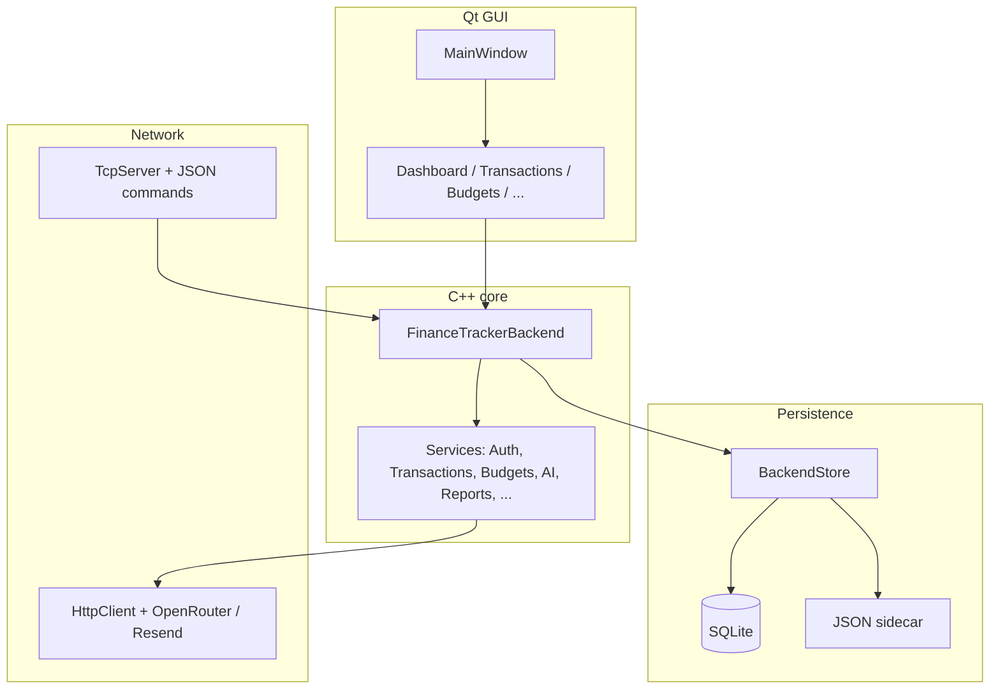

# FinSight

**FinSight** is a cross-platform desktop personal finance application: a **Qt 5 / Qt 6** front end on a **C++20** domain core with **SQLite** persistence, optional **AI-assisted** insights via **OpenRouter**, and optional **email** delivery through **Resend**. The architecture keeps finance rules, persistence, and networking in separate layers so the GUI stays thin and the same backend can be exercised from tests or auxiliary tools.

---

## Table of contents

- [Highlights](#highlights)
- [Architecture](#architecture)
- [Repository layout](#repository-layout)
- [Requirements](#requirements)
- [Build and run](#build-and-run)
- [CMake targets](#cmake-targets)
- [Configuration](#configuration)
- [Testing](#testing)
- [Optional TCP demo](#optional-tcp-demo)
- [Static analysis and debugging](#static-analysis-and-debugging)
- [Data and privacy](#data-and-privacy)

---

## Highlights

| Area | What you get |
|------|----------------|
| **Accounts & money** | Registration, login, sessions, profile, categories, transactions, budgets, savings, goals, receipts |
| **Analytics** | Dashboard metrics, time ranges, text **financial reports** export with optional **AI recommendations** (LFM-style models when configured) |
| **AI** | Dashboard summaries, savings coaching, finance Q&A, receipt hints — routed through OpenRouter with configurable primary and fallback models |
| **Automation** | Optional budget-alert emails via Resend when enabled in `.env` |
| **Quality** | **GoogleTest** suite (`FetchContent`) covering core services; **Boost.Asio** TCP server/client for protocol demos |

---

## Architecture



At a glance: **GUI → `FinanceTrackerBackend` → services**; **store** serializes the backend to **`runtime_data/`** next to the usual install layout; **network** modules call HTTPS APIs or expose a line-oriented JSON TCP API for demos and integration tests.

---

## Repository layout

| Path | Role |
|------|------|
| `src/core/` | Domain models, service layer, `FinanceTrackerBackend` orchestration |
| `src/data/` | `BackendStore`, JSON codecs, persistence glue |
| `src/network/` | HTTP client, OpenRouter chat client, Resend email, JSON helpers, **TCP** server pieces |
| `src/gui/` | Qt entrypoint (`main_gui.cpp`), main window, feature screens (auth, dashboard, transactions, budgets, savings, goals, receipts, profile) |
| `src/apps/` | Standalone **`finsight_server`** / **`finsight_client`** entrypoints |
| `tests/` | `finsight_tests` — GoogleTest + gmock against `finsight_core` |
| `assets/` | Branding (e.g. `logo.svg`) |
| `runtime_data/` | Local **`finsight.db`** and **`sidecar.json`** (created/updated at run time; typical layout: next to the built executable’s parent directory — see `BackendStore` / `main_gui.cpp`) |

---

## Requirements

- **CMake** 3.20 or newer  
- **C++20** compiler (MSVC, GCC, or Clang)  
- **SQLite 3** (dev package on Linux: e.g. `libsqlite3-dev`)  
- **Boost** with **Boost.System** (Asio TCP and optional raw HTTP paths)  
- **Qt** — **Qt 6** preferred (`Widgets`, `Concurrent`, `Network`); falls back to **Qt 5** with the same components  
- **Qt Svg** (optional but recommended for icons / logo rendering)

Configure will **FetchContent** **GoogleTest** v1.14.0 for the test target (network access at configure time).

---

## Build and run

### Configure and compile

```bash
cmake -S . -B build -DCMAKE_BUILD_TYPE=Release
cmake --build build --parallel
```

### Run the desktop app

From the build tree (adjust path to your generator output, e.g. `Release/` on MSVC):

```bash
./build/finsight_gui          # Linux / macOS
build\Release\finsight_gui.exe   # typical MSVC layout
```

### Optional: compile commands (IDE / cppcheck)

```bash
cmake -S . -B build -DCMAKE_EXPORT_COMPILE_COMMANDS=ON
# copy or symlink compile_commands.json to the repo root if your tools expect it there
```

---

## CMake targets

| Target | Description |
|--------|-------------|
| **`finsight_core`** | Static library: domain + persistence + HTTP/AI/email stack |
| **`finsight_gui`** | Primary **Qt** application |
| **`finsight_tcp`** | TCP server library (Boost.Asio) + JSON `BackendMessageHandler` |
| **`finsight_server`** | Listens (default port **9090**), forwards commands to the backend |
| **`finsight_client`** | Minimal line-oriented TCP client for manual or scripted testing |
| **`finsight_tests`** | Unit tests; registered with **CTest** |

---

## Configuration

1. Copy **`.env.example`** to **`.env`** at the **project root** (or place `.env` where `EnvLoader::loadFromNearestFile` can find it — the app walks upward from the working directory and from the executable directory; see `src/gui/main_gui.cpp` and `src/core/utils/EnvLoader.cpp`).

2. Supported keys (see `.env.example`):

| Variable | Purpose |
|----------|---------|
| `OPENROUTER_API_KEY` | Bearer token for OpenRouter (`sk-or-v1-...`) |
| `OPENROUTER_API_URL` | Chat completions endpoint (default: OpenRouter) |
| `EMAIL_ENABLED` | `true` / `false` — gate outbound mail |
| `EMAIL_API_URL` | Resend-compatible API base |
| `EMAIL_API_KEY` | Resend API key |
| `EMAIL_FROM_EMAIL` | Sender address |
| `EMAIL_FROM_NAME` | Display name (default **FinSight**) |

Without a valid OpenRouter key, AI features degrade to **placeholders** or **rule-based fallbacks** where implemented (e.g. exported report recommendations).

---

## Testing

After a successful configure:

```bash
cd build
ctest --output-on-failure
```

Or run the test binary directly:

```bash
./build/finsight_tests
```

Tests live under `tests/` and link **`finsight_core`** plus **GTest / gmock**.

---

## Optional TCP demo

1. Start the server: `./build/finsight_server` (listens on **9090** by default in `server_main.cpp`).  
2. In another terminal: `./build/finsight_client 127.0.0.1 9090`  
3. Send JSON lines (e.g. `{"command":"ping"}`) as documented in the capstone networking branch / `BackendMessageHandler`.

Use this path for demos, teaching, or automation without launching the Qt GUI.

---

## Static analysis and debugging

| Tool | Role | Typical command |
|------|------|-----------------|
| **cppcheck** | Static analysis | `cppcheck --project=compile_commands.json --enable=warning,style,performance,portability -i build src` |
| **Valgrind** | Leaks / invalid memory (Linux or **WSL**) | `valgrind --leak-check=full ./build/finsight_gui` |
| **CMake presets** | Reproducible Debug/ASan builds | Add a `CMakePresets.json` if your team standardizes on it |

On **Windows**, prefer **AddressSanitizer** with MSVC/Clang or tools like **Dr. Memory**; Valgrind does not run Windows PE binaries natively.

---

## Data and privacy

- **Local-first:** user finance data is stored in **`runtime_data/finsight.db`** (and companion JSON) on disk.  
- **Cloud:** only what you enable — OpenRouter (prompts + model responses) and Resend (email), subject to those providers’ policies.  
- **Version control:** avoid committing personal `.env` files or populated `runtime_data/` from real accounts; keep **`.env.example`** as the contract for required keys.

---

## Contributing

Use focused commits, match existing naming and layering (`services` vs `gui`), and extend **tests** when changing behavior in `finsight_core`. For UI work, follow patterns in `src/gui/FinSightUi.h` and sibling windows.

---

## License

Specify your team or institution’s license in this section when you publish the repository publicly.
